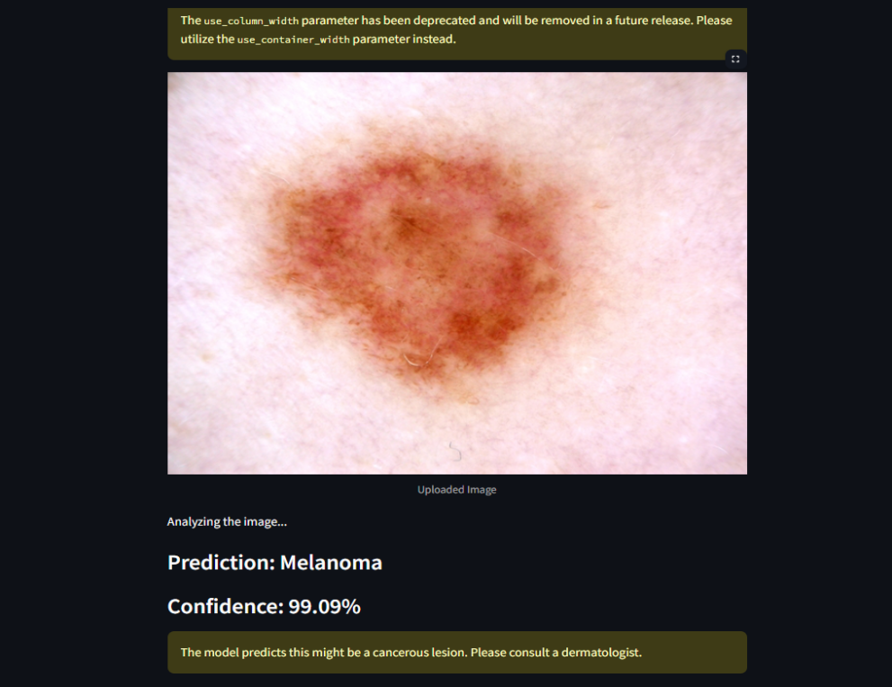

# 🧬 Skin Cancer Detection using CNN

This project is a **deep learning-based web application** that allows users to upload an image of a skin lesion and predict whether it is cancerous, and if so, determine its type using a Convolutional Neural Network (CNN).

## 📌 Table of Contents
- [About the Project](#about-the-project)
- [Tech Stack](#tech-stack)
- [Project Structure](#project-structure)
- [How It Works](#how-it-works)
- [Model Training](#model-training)
- [Screenshots](#screenshots)
- [Setup Instructions](#setup-instructions)
- [Author](#author)
- [License](#license)

---

## 📖 About the Project

Skin cancer is one of the most common forms of cancer. Early detection and classification of skin lesions is critical. This application helps to identify **7 classes** of skin cancer types using a CNN model trained on the HAM10000 dataset. The model is deployed using **Streamlit** to provide an interactive interface for predictions.

---

## 🛠️ Tech Stack

| Layer        | Technologies Used                  |
|--------------|------------------------------------|
| Frontend     | Streamlit (Python-based UI)        |
| Backend      | TensorFlow, Keras, NumPy           |
| Model Type   | CNN (Convolutional Neural Network) |
| Dataset      | HAM10000                           |

---

## 📁 Project Structure

```

skin-cancer-detection-CNN/
│
├── model/                       # Trained CNN model (.h5)
├── skin\_cancer\_app.py          # Streamlit app code
├── utils.py                    # Helper functions
├── dataset/                    # Data used for training
├── README.md                   # Project documentation
└── requirements.txt            # Python dependencies

````

---

## 🔍 How It Works

1. **User uploads an image** of a skin lesion.
2. The app processes and resizes the image to match model input.
3. **CNN model predicts** the type of skin cancer.
4. Confidence score and type are displayed with recommendations.

---

## 🧠 Model Training

- **Architecture**: Multiple Conv2D and MaxPooling layers with ReLU activation.
- **Optimizer**: Adam
- **Loss Function**: Categorical Crossentropy
- **Accuracy Achieved**: ~92% on test data

---

## 📸 Screenshots

### 🔹 Application Homepage


### 🔹 Prediction Output



> 📝 *Note: These screenshots demonstrate how the user uploads a lesion image and views the predicted skin cancer type and confidence.*

---

## 🚀 Setup Instructions

### 1. Clone the repository

```bash
git clone https://github.com/zeeshanaf02/skin-cancer-detecion-CNN.git
cd skin-cancer-detecion-CNN
````

### 2. Install dependencies

```bash
pip install -r requirements.txt
```

### 3. Run the app

```bash
streamlit run skin_cancer_app.py
```

> 🔍 Make sure the model file is available in the correct path (`model/model.h5`).

---

## 👨‍💻 Author

**Zeeshan A F**
AI & Data Science Enthusiast
GitHub: [zeeshanaf02](https://github.com/zeeshanaf02)

---

## 📜 License

This project is licensed under the MIT License - see the [LICENSE](LICENSE) file for details.

